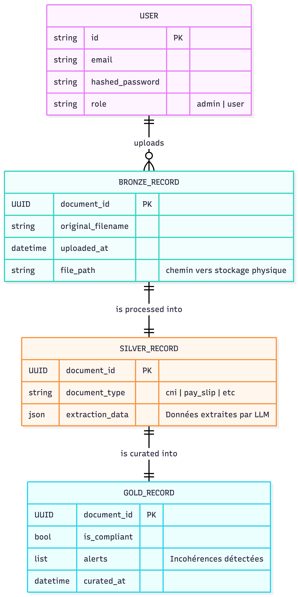
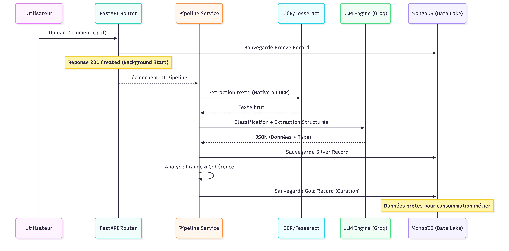

# Document d'Architecture Technique (DAT) - DocFlow
 
**Projet :** DocFlow - Plateforme Intelligente de Traitement Documentaire

---

## 1. Vue d'ensemble du Système

DocFlow est une solution logicielle conçue pour automatiser l'ingestion, l'extraction et la curation de documents administratifs. Le système s'appuie sur une architecture de **Data Lake** moderne (Medallion Architecture) pour garantir la qualité et la traçabilité des données.

### Stack Technologique
*   **Backend :** Python 3.12+ avec le framework **FastAPI** (Haute performance, asynchrone).
*   **Traitement Documentaire :**
    *   `PyPDF` : Extraction native de texte.
    *   `Tesseract OCR` & `pdf2image` : Fallback pour les documents scannés et les images (`PNG`, `JPG`, etc.).
*   **Intelligence Artificielle :** Intégration de LLM (via Groq ou Ollama) pour la classification `backend/app/services/classifier.py` et l'extraction structurée `backend/app/services/extractor.py`.
*   **Base de Données :** **MongoDB** (Stockage orienté documents), utilisé via `Motor` (driver asynchrone).
*   **Sécurité :** JWT (JSON Web Tokens) pour l'authentification et Bcrypt pour le hachage des mots de passe.
*   **Frontend :** React avec Vite.js et Tailwind CSS pour l'interface utilisateur.

---

## 2. Architecture Logicielle

Le projet suit un pattern de type **Layered / Clean Architecture**, isolant les responsabilités :

*   **API Layer (`app/api/`) :** Gère les points d'entrée (routes), la validation des requêtes et les réponses HTTP.
*   **Service Layer (`app/services/`) :** Contient la logique métier. Le `backend/app/services/pipeline.py` orchestre le passage d'une zone de données à l'autre.
*   **Data Models (`app/schemas/`) :** Définition des contrats de données via `Pydantic`, assurant une validation stricte à chaque étape.
*   **Storage Layer (`app/storage/`) :** Abstraction de l'accès au Data Lake physique. Support du stockage **Local** (Volume Docker) et du stockage **Cloud (`Cloudinary`)** pour la Zone Bronze.

---

## 3. Modèle de Données

Le stockage est organisé selon le concept de zones (Bronze, Silver, Gold). Voici les entités principales et leurs relations.

  

---

## 4. Flux de Fonctionnement (Workflow)

### Cycle de vie d'une requête (Upload & Process)
1.  Le client envoie un fichier via `POST /api/documents/upload`.
2.  Le middleware d'authentification `backend/app/api/auth.py` valide le JWT.
3.  Le fichier est écrit sur disque (`storage/bronze`) ou uploadé sur **Cloudinary**, et un enregistrement `BronzeRecord` `backend/app/schemas/datalake.py` est créé dans MongoDB.
4.  Une **Background Task** est lancée via FastAPI pour ne pas bloquer le client.
5.  Le pipeline `backend/app/services/pipeline.py` effectue l'OCR -> Classification -> Extraction.
6.  Les données sont croisées pour vérification `backend/app/services/pipeline.py`.

### Flux Critique : Processus de Traitement Documentaire

  

---

## 5. Points Critiques

### Sécurité (Zero-Trust Approach)
*   **Authentification :** Implémentée dans `backend/app/api/auth.py`. Utilise `OAuth2PasswordBearer`.
*   **Autorisation :** Utilisation de dépendances FastAPI (`require_admin`) pour restreindre l'accès aux routes sensibles (ex: `list_documents` filtrée par utilisateur).
*   **Intégrité :** Les index MongoDB (`_ensure_indexes` dans `backend/app/db/mongodb.py`) garantissent l'unicité des documents à travers les zones du Data Lake.

### Gestion d'état
L'architecture est **stateless**. L'état de traitement d'un document est déduit de sa présence dans les collections `bronze`, `silver` ou `gold`. Les échecs de traitement sont tracés via des logs structurés.

---

## 6. Infrastructure & Déploiement

La stratégie de déploiement repose sur la conteneurisation complète.

*   **Dockerisation :** 
    *   Un `backend/Dockerfile` (multi-stage) pour le backend incluant les dépendances OS (`tesseract-ocr`, `poppler-utils`).
    *   Un `docker-compose.yml` orchestrant le backend, la base MongoDB et l'UI.
*   **Orchestration :** L'utilisation d'**Airflow** (`airflow/dags/`) permet de surveiller les conteneurs et d'orchestrer les flux de données.
    *   `monitor_containers.py` : Surveillance de la vitalité des services (Backend, DB...).
    *   `generate_real_documents.py` : DAG d'injection de données de test pour simulation.
